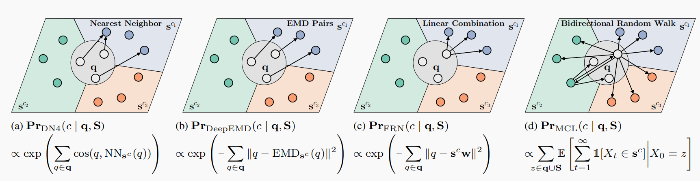

# Paper Reading

## 1.作者信息

Yang Liu 浙江大学

## 2.问题定义

## 3.相关工作

数据中具有密集代表性的局部特性，可以提供跨类别的可转移信息，这些信息在小样本场景中显示出了良好的性能。在图1所示的方法中

DN4为每个查询特征找到最近邻支持特征，并以朴素贝叶斯的方式累积所有局部匹配来表示图像到类的相似性；

DeepEMD 使用移动距离来比较由局部特征组成的复杂结构表示。

FRN 在一个潜在空间中使用支持密集特征的线性组合来重建每个查询密集特征，并利用重建距离来测量图像到类重要性它们都遵循一个单向查询到支持的范式，其明显的特征是对所有查询特性的积累，然后是一个软最大概率。

贡献：

(1)我们建议学习查询和支持密集特征之间的相互联系，而不是遵循FSL中的单向查询到支持范式。

(2)我们引入了密集特征对FSL的可访问性，并证明了如果我们将来自单个查询图像的密集特征作为一组未标记的数据来处理，传统的转换方法可以很容易地适应归纳设置。

(3)我们在FSL中提出了一种新的基于双向随机游走的方法，并将其与隶属网络的单模特征向量中心性联系起来。

(4)通过突出任务集中的局部特征，而不是全局平均池化，可以插入现有的基于全局特征的方法，如原网和关系网。

## 4.动机和思路

在本文中，我们合并了一个额外的支持-查询连接作为一个补充，以完全附属于两个不相交的密集特征集。这种双向范式所提供的潜力源于一种直觉，即除了使用查询特征来寻找相关的支持特征外，还可以根据支持特征来估计查询特征的任务相关性。具体地说，我们将密集特征与可以双向随机游走的粒子与离散特征空间中相反的密集特征联系起来。然后通过密集特征的可访问性来估计每个类的预测概率，即在时间齐次马尔可夫过程中对该类的密集特征的期望访问次数。

- 作者从已有工作的哪些局限性出发, 通过什么方式来改进?
- 作者采用的方法是否能对应到其出发点? paper提供的实验结果是否验证了作者的改进?
- 作者的思路有什么缺陷? 如何改进?

## 5.算法流程

- 尽量以流程图的方式来描述, 明确各个子模块的输入输出
  - 如果是ML算法, **可以先描述inference流程, 再描述training流程**.
- 列出核心公式
- 尝试做性能推理, 对算法流程中paper新引入的模块作用给出结论
  - 通常来说, paper会给出对应的实验结果, 可以根据该结果定量分析.
  - 尝试对比不同paper的结果, 可能会发现不一致, 有助于判断新模块的有效性.
  - 对于熟悉的领域, 可以尝试给一些定性的讨论.

## 6.实验结果

- 对于每个实验: (非常类似于我们自己做实验时所做的实验记录和实验报告)
  - 该实验讨论什么问题?
  - 实验设计是否合理? 能否很好地回答此问题?
  - 实验预期是什么? 结论是什么?
- 有哪些需要注意的实验细节? (数据处理? 参数等?)

## 7.源代码分析

- 如果作者提供了源代码, 我们需要对源代码进行阅读和分析, 应该回答如下问题:
  - 预期是否可以复现出作者的实验结果? 代码是否完整?
  - 对于某些特殊模块是怎么实现的? 可以示例核心代码.
  - 是否有一些实验细节文章中没有提及, 但是在代码中有体现的?