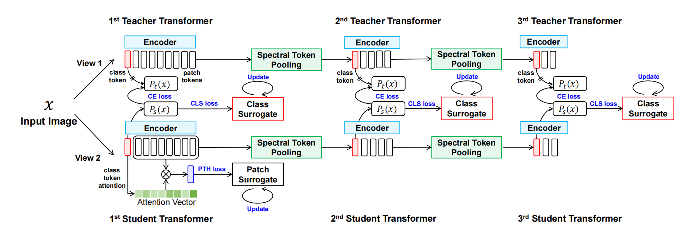
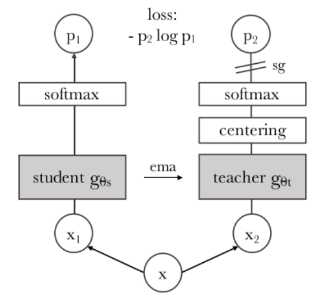
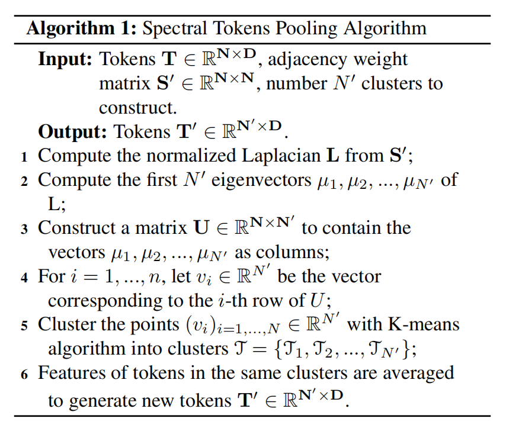
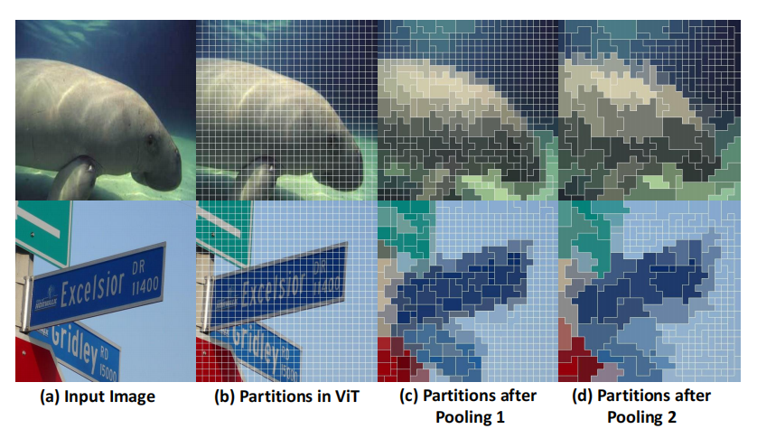
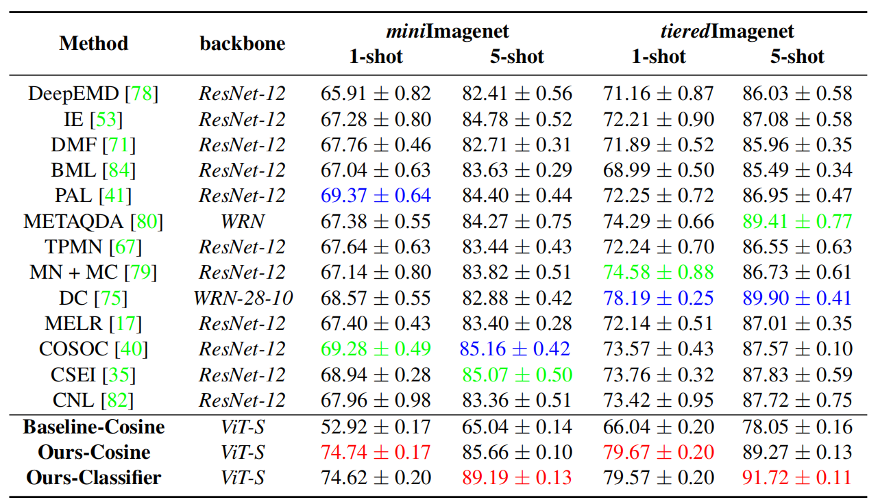
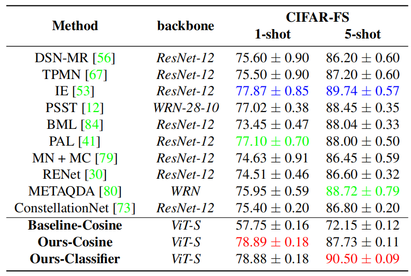
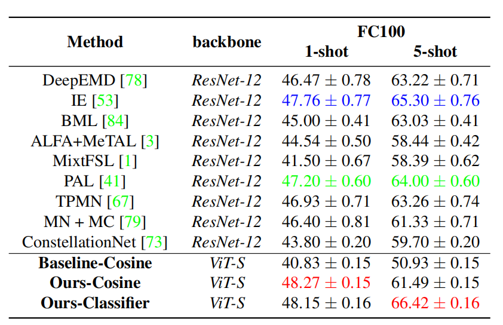

# Paper Reading
2022年CVPR
## 1.作者信息

- 一作：Yangji He  复旦大学计算机学院Nebula AI Group,上海信息处理智能密钥实验室
- 通讯作者： Weifeng Ge 复旦大学计算机学院Nebula AI Group,上海信息处理智能密钥实验室

## 2.问题定义

- VIT被认为很有潜力超越CNN的识别方法，但是在少量数据下很容易导致过拟合，通过解决VIT的数据饥渴问题，来研究小样本学习。

## 3.相关工作

相关工作
- 小样本学习：元学习已经成为小样本学习的主导范式，但是与以标准方式对预先训练的CNN特征提取器进行微调相比，用元学习从头开始训练CNN的性能较差。还有其他方法侧重于更好的特征提取、数据增强、知识转移和图神经网络。

- VIT：VIT只关注全局信息，而忽略了本地连接，这阻碍了细粒度图像特性的使用，从而导致了它们渴望数据的特性。许多后续工作通过建立一个渐进缩小的金字塔来解决这个问题，允许模型显式地处理细粒度图像特性。

- VIT中的token：在VIT中通过添加一个分类token来接收监督信号，帮助最后的分类。在一些工作建议中采用池化的操作通过集patch来构造全局token，LVVIT探索联合使用class token和patch token的可能性，So-ViT 将二阶和交叉协方差池应用于视觉标记，并与标记结合以进行最终分类。

作者贡献：

- 通过VIT提出了HCTransformers模型 。

- 提出了token谱聚类层，作用是获取并利用图像内部结构来降低目标前景区域和背景噪声区域分界的模糊性（也就是让目标和噪声的边界更清晰） 。

- 出了一个标签代理学习方案，作用是充分利用图像-标签对的视觉信息而不是单一的标签视觉概念。

- 在miniImageNet, tieredImageNet , CIFAR-FS 和 FC-100超过了DINO基线。

作者的方法
-  HCTransformers的核心是充分利用注释数据来训练Transformers作为一个强的元特征提取器的小样本学习。使用DINO作为基础学习框架和 multi-crop strategy来进行知识蒸馏。 

- 作者将patch token集成为加权和，其中分数是根据它们与全局 class token的连接计算的，其目的是主要利用重要的patch token。此外，我们假设集成patch token不与 class token共享特征空间，并在自己的特征空间内监督它们。

## 4.动机和思路

- 作者从已有工作的哪些局限性出发, 通过什么方式来改进?
- 作者采用的方法是否能对应到其出发点? paper提供的实验结果是否验证了作者的改进?
- 作者的思路有什么缺陷? 如何改进?

## 5.算法流程

### 整体流程

在小样本学习的预训练阶段，访问图像标签。为patch token和 class token设计了一个潜在的属性替代学习方案，以避免直接从标签中学习。为了将语义层次结构合并到转换器中，我们在两个ViT之间插入了一个光谱标记池化层。利用斑块的输出相似度矩阵进行光谱聚类，将斑块分割成不相交的区域。然后将同一区域patch 的特征平均值作为一个新的标记特征，捕获更高级的语义信息。在图1中，我们说明了我们所提出的方法的完整管道。

### 前期准备

与BYOL 、DINO类似，采用了一个知识蒸馏框架进行自监督学习的两个同质网络：教师和学生，其中教师参数（θt）是在ViT 架构基础上更新的学生参数（θs）的EMA结果。每个网络由一个transformer编码器和一个分类头（即，一个多层感知器和一个完全连接的层）组成。DINO还采用了multi-crop训练增强方案。对于任何给定的图像x，它构造了一个子区域的集合V，包括两个全局视图，$xg1$和$xg2$和m个局部视图。DINO将以下损失最小化，以鼓励“局部到全局”的预测一致性：基于DINO的loss函数
$$
\mathcal{L}_{\text {DINO }}=\frac{1}{M} \sum_{x_g \in\left\{x_1^g, x_2^g\right\}} \sum_{x^{\prime} \in V, x^{\prime} \neq x_g}-P_t\left(x_g\right) \log P_s\left(x^{\prime}\right)
$$
其中M是对数$2×（m+1）,Pt（xg）、Ps（x 0）$分别是教师网络和学生网络的输出

### 联合属性代理和参数学习

避免仅通过相当有限的单热标签来监督参数学习。对于标签空间中的每个视觉概念，学习一个语义属性代理$z (y)∈R1×D0$，
$$
\theta_s^{t+1}=\theta_s^t-\gamma_1 \frac{\partial \mathcal{L}_{\text {surr }}}{\partial \theta_s^t}
\\
z(y)^{t+1}=z(y)^t-\gamma_2 \frac{\partial \mathcal{L}_{\text {surr }}}{\partial z(y)^t},
$$
通过高斯噪声进行初始化，使用AdamW作为优化器，用Linear Scaling Rule更新。(facebook提出了 Linear Scaling Rule，当 Batch size 变为 K 倍时，Learning rate 需要乘以 K 就能够达到同样的训练结果。看似简单的定律，Facebook 的论文给出了不完整的理论解释和坚实的实验证明。除此之外，论文还讨论了如何处理 Batch Normalization 如何实现分布式 SGD。通过 Linear Scaling Rule，Facebook 成功的在一小时内训练了 Batch size 为 8192 的 Resnet 50。)

为了充分利用transfomer的优势，分别学习了**patch token**和**class token**的语义属性代理。

**class token**

使用代理损失来监督每个类的概率分布学习，那么y类的语义属性代理 $zc (y)∈R^{8192}$ 是8192维上的一个向量。用Softmax操作对$zc (y)$进行归一化，得到一个属性分布 $\overline {zc} (y)$ 。class token损失变为：
$$
\mathcal{L}_{\mathrm{surr}}^{\mathrm{cls}}=\frac{1}{2} \sum_{x_g \in\left\{x_1^g, x_2^g\right\}} D_{\mathrm{KL}}\left(P_s\left(x_g\right) \| \overline{z_c}(y)\right)
$$

KL散度：衡量的是相同事件空间里的两个概率分布的差异情况。

这里的损失函数只考虑global views而不考虑local views，作者说local views在更新类中心时由于有图像信息的丢失可能会产生负面影响。

**patch token**

由于缺乏patch级的注释，patch token很难被监督。为了监督patch token，我们首先将patch token特征$fp (x)$聚合，通过应用注意力映射$Ac (x)∈R1×N$来生成图像x的全局描述符：
$$
F_p(x)=\mathbf{A}_c(x) f_p(x)
$$
其中，Ac (x)表示通过计算class token与每个patch token之间的相似度，可以获得的相似度矩阵。

将$Fp (x)$中的每个条目视为对一些语义属性的描述，并使用Softmax操作对其进行规范化，以将其转换为属性分布$\overline {Fp} (x) = Softmax\ Fp (x)$。与class token中的情况类似，我们对每个类都有一个属性代理$zp (y)$。patch token变为：
$$
\mathcal{L}_{\mathrm{surr}}^{\mathrm{pth}}=\frac{1}{2} \sum_{x_g \in\left\{x_1^g, x_2^g\right\}} D_{\mathrm{KL}}\left(\bar{F}_p(x) \| \bar{z}_p(y)\right)
$$

## Spectral Tokens Pooling

对于ViT中的N个斑块标记，$A_p∈RN×N$ 为patch之间的注意矩阵。为了引入空间一致性，我们保持了一个邻接矩阵$H∈RN×N$来反映邻域关系。在我们的设计中，只有8个连接的相邻token与中心token连接。我们用下面的公式来检索一个对称的S矩阵。
$$
\mathbf{S}=\mathbf{A}_{\mathbf{p}} \odot \mathbf{H}+\mathbf{A}_{\mathbf{p}}^{\top} \odot \mathbf{H}^{\top}
$$
对S的每一行执行Softmax操作，得到最终的邻接权值矩阵$S'$。利用spectral clustering algorithms将patch token划分为$N'$个聚类T = {T1、T2、...，TN0 }，并利用算法1生成新的标记。在反向阶段，token集群的梯度被复制到每个平均token中，图2显示了两个连续的光谱标记池的结果。

由于在spectral tokens池化中计算特征向量是耗时的（两个池化层分别为21.3im/s和75.2im/s），我们没有端到端联合使用这三个变压器。训练可分为两个阶段。在第一阶段，我们将前两个变压器训练为与DINO [7]相同的设置，损失函数如下，
$$
\mathcal{L}_{\text {stage } 1}=\mathcal{L}_{\mathrm{DINO}}+\alpha \mathcal{L}_{\mathrm{surr}}^{\mathrm{cls}}+\beta \mathcal{L}_{\mathrm{surr}}^{\mathrm{pth}}
$$
然后冻结前两组变压器的参数，以相同的损耗函数对后两组变压器进行训练.在第二阶段，我们只监督class token以提高效率。由于第一个transformer产生的特征已经具有很强的鉴别能力，后续变压器的训练在几个时期快速收敛。
$$
\mathcal{L}_{\text {stage } 2}=\mathcal{L}_{\text {DINO }}+\alpha \mathcal{L}_{\mathrm{surr}}^{\mathrm{cls}}
$$
权重α和β被设置为1和0.1

## 6.实验结果

- 对于每个实验: (非常类似于我们自己做实验时所做的实验记录和实验报告)
  - 该实验讨论什么问题?
  - 实验设计是否合理? 能否很好地回答此问题?
  - 实验预期是什么? 结论是什么?
- 有哪些需要注意的实验细节? (数据处理? 参数等?)

## 7.源代码分析

- 如果作者提供了源代码, 我们需要对源代码进行阅读和分析, 应该回答如下问题:
  - 预期是否可以复现出作者的实验结果? 代码是否完整?
  - 对于某些特殊模块是怎么实现的? 可以示例核心代码.
  - 是否有一些实验细节文章中没有提及, 但是在代码中有体现的?

[CVPR2022|论文笔记：HCTransformer - 知乎 (zhihu.com)](https://zhuanlan.zhihu.com/p/508652133)