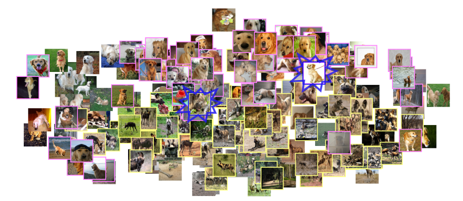
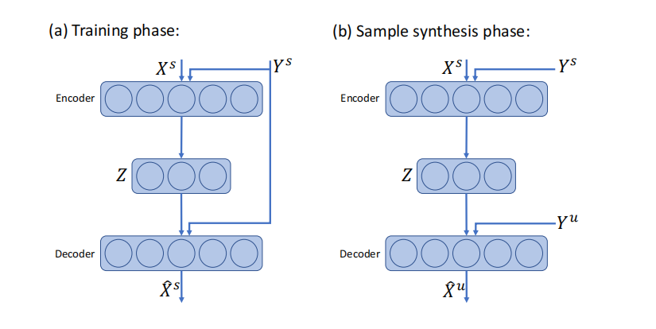
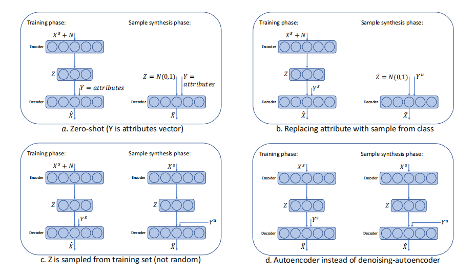

# 9月13日论文笔记

# 基于数据扩充的小样本学习方法delta encoder->DTN

## delta encoder 引言

小样本一直是计算机视觉中长期存在的一个挑战，作者提出了一种简单有效的小样本图片识别方法，该方法基于一个改进的自动编码器（Δ-encoder），他通过学习很少的样本来合成一个未知的新样本，然后通过合成的样本进行分类。

该方法在同类训练样本对中学习一种可转移的内类变形（Δ），并将这些Δ应用于新的类别，通过解码器合成新类别样本，该方法在小样本有相当的性能

虽然人类大脑的确切工作原理还远没有被完全理解，但人们具有推理能力，人类很可能从类比中学习。也就是说，我们在新对象中识别出一些潜在语义结构的元素，存在于其他已经熟悉的类别中，并使用这种结构为生成新类别。同样，在计算机视觉领域，我们假设我们可以使用丰富的有标签数据学期期中潜在的语义空间，则只需要给出的只有一个或几个例子，来学习新样本的分布。

基于几个观察到的例子，通过神经网络从新样本分布中抽取样本，通过这些样本进行分类，是作者提出的方法的本质。首先，所提出的方法学习提取，然后在可见（训练）类的例子对之间采样（合成）可转移的非线性变形。我们将这些变形称为特征空间中的“Δ”。其次，它学会了Δ，并将其应用在训练过程中未见过的新类别的例子中，以便有效地从这些类别中合成新的样本。因此，在小样本场景中，我们能够合成每个新类别的足够样本，以标准监督的方式训练分类器。

作者提出的解决方案是一种简单而有效的方法（根据所获得的实证结果），用于在提供该类的一个或几个例子后，从类分布中学习抽样。在各种标准的小样本分类基准上，与最先进的少镜头分类方法相比，它表现出了改进的性能。

## Δ encoder介绍

作者在同一个样本对中学习出了，非线性的内类转移变换（Δ），将这种转移变换作用与新样本上，合成出新类的样本，假设给出一个属于特定类别C的样本Y，我们的目标是学习抽样属于同一类别的其他样本X。换句话说，我们想学习从后验类中取样： $P(X|C，Y)$。注意，对Y的约束作用意味着我们可能不会学习从整个类的后验中采样，而是从它的某些“模态”子集中采样，这使用我们可以学习从Y中获得提取的变形Δ。我们的方法受到了[3]中用于零射击分类的方法的启发，其中解码器以人工注释属性的形式提供了关于类的边信息。

我们的生成模型是一个自动编码器（AE）的一个变体。标准AE通过最小化$||X−\widehat{X}||_1$来学习重构信号X，其中$\widehat{X}=D(E(X))$是由AE重构的信号，E和D分别是编码器和解码器子网络。对于AE的一个常见假设是，中间瓶颈表示E (X)的维数可能比X要低得多。这是由假设提取X的“语义本质”的能力驱动的——重建所必需的X的最小识别特征集。这项工作的简单关键思想是改变E (X)的含义，从表示X的“特征”，到表示从Y重建X所需的“同类转移信息”（从同一类别的观察到的例子）。为此，如下图a所示

编码器输入信号X和“同类”样本Y并且学习计算表示此类的信息$Z=E(X,Y)$，解码器D通过Z和Y重建X。控制Z不能太大以确保解码器D不能使用Z重建X。通过这种方式，我们将编码器规范化，以强烈地依赖于样本Y来进行重建，从而实现如下所述的合成。训练结束后，在样本合成阶段，我们使用训练后的网络从$P(X|C，Y)$中采样。我们使用Z的非参数分布，通过从训练过程中看到的类中抽样随机对{Xs，Ys}（这样Xs和Ys属于同一类别），并使用训练后的编码器从中生成Z = E（Xs，Y s）。因此，我们最终得到了一组样本{Zi}。

在每一个实验中，对于一个新的看不见的类U，我们提供了一个例子$Y_u$，从中我们使用我们训练的生成器模型为类U合成了一组样本： ${D(Zi，Y_u)}$。这个过程如b所示。最后，我们使用合成的样本来训练一个线性分类器（一个密集的层，然后是softmax）。作为一个直接的扩展，对于k-shot学习，我们重复这个过程k次，根据每个提供的k个例子独立地合成样本。

## delta encoder 实验细节

在所有的实验中，图像都是用预先计算好的特征向量来表示的。在作者所有的实验中，我们都使用VGG16 或ResNet18 模型进行特征提取。对于这两种模型，最后输出层，（即最后一次卷积后的层），被两个完全连接的层所取代，具有2048个输出单元的再通过ReLU激活。通过损失函数$loss：\sum_iw_i||X−\widehat{X}||_1$更新权重，$w_i=\left|X_i-\hat{X}_i\right|^2 /\|X-\hat{X}\|_2$，通过ReLU$(\max (x, 0.2 \cdot x))$激活，编码器的输出Z是16维的。所有模型都使用Adam优化器进行训练，学习速率设置为$10^{−5}$。所有层都采用50%的dropout。在所有的实验中，每个看不见的类都合成了1024个样本。∆编码器训练大约需要10个epochs才能达到收敛；在Nvidia Tesla K40m GPU（48K训练样本，批大小为128）上运行大约需要20秒。数据生成阶段每1024个样本大约需要0.1秒。该代码可以在这里找到:

[GitHub - EliSchwartz/DeltaEncoder: This is the tensorflow implementation for the paper "Delta-encoder: an effective sample synthesis method for few-shot object recognition" https://arxiv.org/abs/1806.04734](https://github.com/EliSchwartz/DeltaEncoder)

## DTN

它学习迁移已知类别中潜在的多样性,并将其与支持集的特征相结合,从而在特征空间域中生成样本。这种生成方式类似于 DeltaＧEncoder的偏移量学习,区别在于DTN是通过最小化元分类损失来进行学习，而非基于特征重构损失进行学习。

