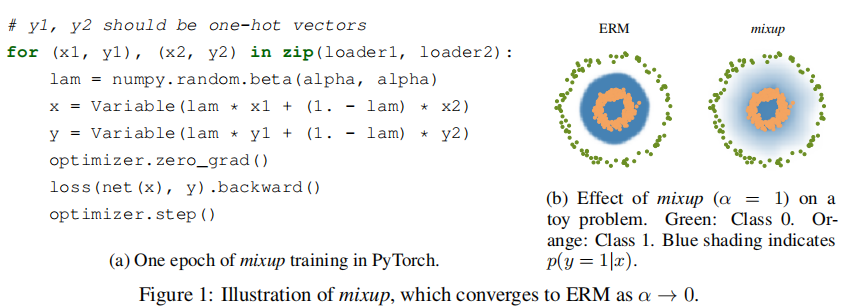
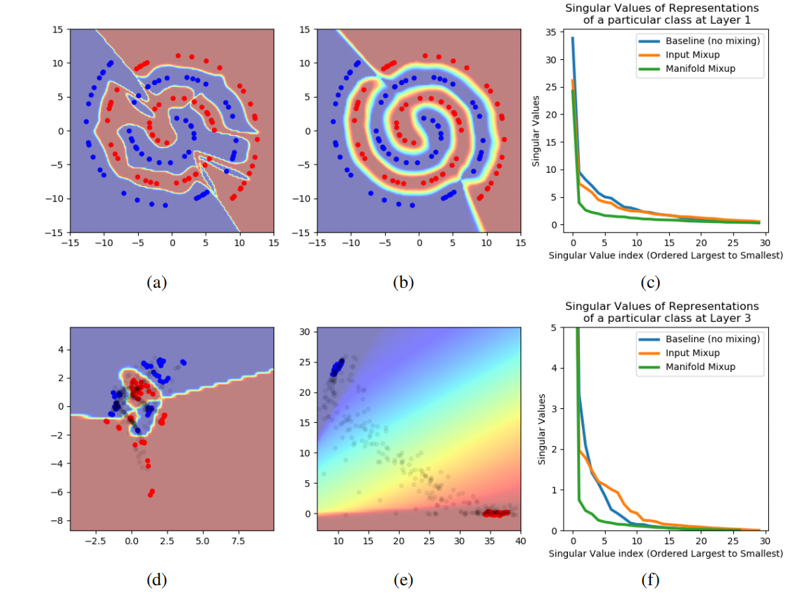
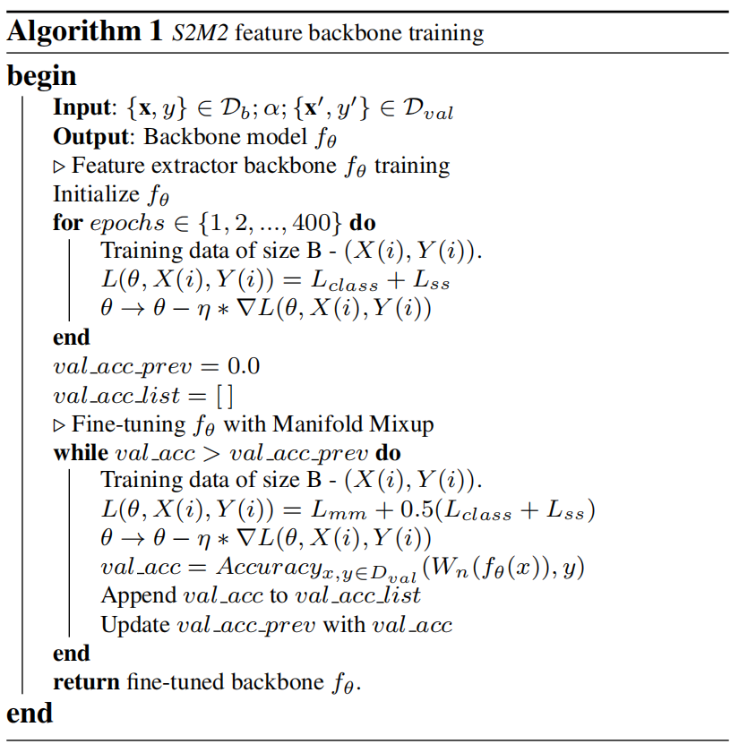

# 9月18日论文笔记

## Mixup介绍

大型深度神经网络功能强大，但表现出不良行为，例如 作为对对抗性例子的记忆和敏感性。 在这项工作中，我们建议 mixup，一个简单的学习原理来缓解这些问题。 本质上，混合训练 一个关于成对示例及其标签的凸组合的神经网络。 通过这样做，mixup 对神经网络进行正则化以支持简单的线性行为 中间的训练示例。 我们在 ImageNet-2012、CIFAR-10、 CIFAR-100、Google 命令和 UCI 数据集表明，mixup 提高了 最先进的神经网络架构的概括。 我们还发现 mixup 减少了损坏标签的记忆，增加了对损坏标签的鲁棒性 对抗样本，并稳定生成对抗网络的训练。

大型深度神经网络使计算机视觉等领域取得突破（Krizhevsky et al., 2012)、语音识别 (Hinton et al., 2012) 和强化学习 (Silver et al., 2016)。 在大多数成功的应用中，这些神经网络有两个共同点。 首先，它们是 训练以最小化他们对训练数据的平均误差，**学习规则也称为 经验风险最小化 (ERM) 原则 (Vapnik, 1998)**。 其次，这些最先进的神经网络的规模与训练样本的数量成线性关系。 例如，网络 斯普林伯格等人。 (2015) 使用 106 个参数对 5·104 进行建模 CIFAR-10 数据集中的图像， (Simonyan & Zisserman, 2015) 的网络使用 108 个参数对 106 中的图像 ImageNet-2012 数据集，以及 Chelba 等人的网络。 (2013) 使用 2·1010 个参数进行建模 十亿字数据集中的 109 个字。

引人注目的是，学习理论中的一个经典结果（Vapnik & Chervonenkis，1971）告诉我们，只要学习机器（例如，神经网络）的大小不随着训练数据的数量而增加，ERM的收敛性是可以保证的。但是现在学习机器的大小是根据其参数的数量或相关的vc复杂度来衡量的（Harvey et al.，2017）

这一矛盾挑战了ERM训练我们当前的神经网络模型的适用性，如最近的研究所强调的。一方面，即使是在存在强正则化的情况下，或者在随机分配标签的分类问题中（Zhang et al.，2017），ERM依然允许大型神经网络记忆（而不是从训练数据中泛化）。另一方面，使用ERM训练的神经网络在训练分布之外的例子上进行评估时，会显著改变它们的预测（Szegedy et al.，2014），也被称为对抗性例子。这一证据表明，ERM无法解释或提供与训练数据仅略有不同的测试分布的泛化。然而，ERM的替代方案是什么呢？

在与训练数据相似但不同的示例上进行训练的选择方法称为数据增强（Simard 等人，1998 年），由邻近风险最小化 (VRM) 原则形式化（Chapelle 等人，2000 年）。在 VRM 中，需要人类知识来描述附近或邻里围绕训练数据中的每个示例。然后，可以从训练样例的邻近分布，以扩大训练分布的支持。为了例如，在执行图像分类时，通常定义一张图像的附近作为其水平反射、轻微旋转和轻微缩放的集合。虽然数据增强始终导致改进的泛化 (Simard et al., 1998)，该过程依赖于数据集，因此需要使用专业知识。此外，数据增强假设附近的示例共享同一类，并且不对示例之间的附近关系进行建模的不同类别。

## 贡献

基于这些问题，我们引入了一个简单的、与数据无关的数据增强例程，称为混合程序（第2节）。简而言之，混合构造了虚拟训练示例

$\tilde{x}=\lambda x_i+(1-\lambda) x_j, \quad$ where $x_i, x_j$ are raw input vectors
       $\tilde{y}=\lambda y_i+(1-\lambda) y_j, \quad$ where $y_i, y_j$ are one-hot label encodings

xi，yi）和（xj，yj）是从我们的训练数据中随机抽取的两个例子，以及λ∈[0,1]。因此，混合通过结合特征向量的线性插值应该导致相关目标的线性插值的先验知识，从而扩展了训练分布。混合可以在几行代码中实现，并引入最小的计算开销。

尽管它很简单，但 mixup 允许在 CIFAR-10、CIFAR-100 和 ImageNet-2012 图像分类数据集（第 3.1 和 3.2 节）。 此外，混在从损坏的标签中学习（第 3.4 节）或面对对抗性示例（第 3.5 节）。 最后，mixup 提高了语音的泛化能力（第 3.3 节）和表格（第 3.6 节）数据，可用于稳定 GAN 的训练（第 3.7 节）。 这复制我们的 CIFAR-10 实验所需的源代码可在以下位置获得:https://github.com/facebookresearch/mixup-cifar10

为了了解混合中各种设计选择的影响，我们进行了一套彻底的消融研究实验（第 3.8 节）。 结果表明，mixup 的性能明显优于以前工作中的相关方法，每个设计选择都有助于最终的性能。
最后，我们探索与先前工作的联系（第 4 节），并提供一些观点供讨论（第 5 节）。

## 从经验风险最小化到mixup

在监督学习中，我们感兴趣的是找到一个函数f∈F，它描述了随机特征向量X和随机目标向量Y之间的关系，它遵循联合分布P（X，Y）。为此，我们首先定义一个损失函数，它惩罚预测f (x)和实际目标y之间的差异，例如（x，y）∼P。然后，我们最小化损失函数在数据分布P上的平均值，也称为预期风险：
$$
R(f)=\int \ell(f(x), y) \mathrm{d} P(x, y)
$$
不幸的是，在大多数实际情况下，分布P是未知的。相反，我们通常可以访问一组训练数据D = {（xi，yi）}ni=1，其中（xi，yi）∼P for all i = 1，……，n。利用训练数据D，我们可以用经验分布来近似P
$$
P_\delta(x, y)=\frac{1}{n} \sum_{i=1}^n \delta\left(x=x_i, y=y_i\right)
$$
其中，δ（x = xi，y = yi）是一个以（xi，yi）为中心的Dirac质量。使用经验分布Pδ，我们现在可以用经验风险来近似预期风险：
$$
R_\delta(f)=\int \ell(f(x), y) \mathrm{d} P_\delta(x, y)=\frac{1}{n} \sum_{i=1}^n \ell\left(f\left(x_i\right), y_i\right)
$$
通过最小化(3)来学习函数f被称为经验风险最小化（ERM）原理（Vapnik，1998）。虽然可以进行有效的计算，但经验风险(1)只在有限的n个例子集上监测f的行为。当考虑具有与n相当的数字参数的函数（如大型神经网络）时，最小化(1)的一个简单方法是记忆训练数据（Zhang et al.，2017）。记忆反过来导致训练数据之外的不良行为（Szegedy et al.，2014）。

然而，朴素估计 Pδ 是逼近真实分布 P 的许多可能选择之一。例如，在邻近风险最小化 (VRM) 原则 (Chapelle et al., 2000) 中，分布 P 近似为
$$
P_\nu(\tilde{x}, \tilde{y})=\frac{1}{n} \sum_{i=1}^n \nu\left(\tilde{x}, \tilde{y} \mid x_i, y_i\right)
$$
本文的贡献是提出了一个一般的邻近分布，称为混合：
$$
\mu\left(\tilde{x}, \tilde{y} \mid x_i, y_i\right)=\frac{1}{n} \sum_j^n \underset{\lambda}{\mathbb{E}}\left[\delta\left(\tilde{x}=\lambda \cdot x_i+(1-\lambda) \cdot x_j, \tilde{y}=\lambda \cdot y_i+(1-\lambda) \cdot y_j\right)\right]
$$
中，λ∼Beta（α，α），用于α∈（0，∞）。简而言之，从混合附近分布中采样产生虚拟特征目标向量
$$
\begin{aligned}
&\tilde{x}=\lambda x_i+(1-\lambda) x_j \\
&\tilde{y}=\lambda y_i+(1-\lambda) y_j
\end{aligned}
$$
其中（xi，yi）和（xj，yj）是从训练数据中随机抽取的两个特征目标向量，和λ∈[0,1]。混合超参数α控制特征-目标对之间的插值强度，将ERM原理恢复为α→0。

混合训练的实现很简单，并引入了最小的计算开销。图1a显示了在PyTorch中实现混合训练所需的几行代码。最后，我们提到了其他的设计选择。首先，在初步实验中，我们发现三个或三个以上的例子的凸组合不能提供进一步的增益，而是增加了混合的计算成本。其次，我们当前的实现使用单个数据加载器来获得一个小批，然后在随机洗牌后将混合应用于同一个小批。我们发现这种策略同样有效，同时减少了I/O需求。第三，只在具有相同标签的输入之间进行插值并不会导致后续文章中讨论的混淆的性能提高。更多的实证比较可以在第3.8节中找到。

## **What is** **mixup** **doing?** 

mixup 邻位分布可以理解为一种数据增强形式，它鼓励模型 f 在训练示例之间线性表现。 我们认为，这种线性行为减少了在训练示例之外进行预测时的不良振荡量。 此外，从奥卡姆剃刀的角度来看，线性是一种很好的归纳偏差，因为它是最简单的可能行为之一。 图 1b 表明，混合导致决策边界从类到类线性转换，从而提供更平滑的不确定性估计。 图 2 说明了使用 ERM 和 mixup 在 CIFAR-10 数据集上训练的两个神经网络模型的平均行为。 两种模型具有相同的架构，使用相同的程序进行训练，并在随机采样的训练数据之间的相同点进行评估。 使用 mixup 训练的模型在模型预测和训练样本之间的梯度范数方面更加稳定。

## Manifold Mixup

### 引言

深度神经网络擅长学习训练数据，但在对略有不同的测试示例进行评估时，通常会提供不准确低置信度的预测。这包括分布变化、异常值和对抗性示例。为了解决这些问题，我们提出了 Manifold Mixup，这是一个简单的正则化器，它鼓励神经网络对隐藏表示的插值进行低置信度的预测。 Manifold Mixup 利用语义插值作为额外的训练信号，在多个表示级别上获得具有更平滑决策边界的神经网络。因此，使用 Manifold Mixup 训练的神经网络可以学习具有较少方差方向的类表示。我们证明了为什么在理想条件下会发生这种扁平化的理论，在实际情况下对其进行验证，并将其与以前的信息论和泛化工作联系起来。尽管不会产生大量计算并在几行代码中实现，但 Manifold Mixup 提高了监督学习的强大基线、对单步对抗性攻击的鲁棒性和测试对数似然性。

### 介绍

深度神经网络是最先进的计算机视觉、语音识别和语言翻译系统的支柱（LeCun 等人，2015 年）。然而，这些系统只有在与训练集非常相似的实例上进行评估时才会表现良好。在对稍微不同的分布进行评估时，神经网络通常会以极高的置信度提供不正确的预测。这是一个令人担忧的前景，因为深度学习系统正在部署在数据可能会受到分布变化影响的环境中。对抗性示例 (Szegedy et al., 2014) 就是这样的失败案例之一：在对人眼无法察觉的扰动进行评估时，具有近乎完美性能的深度神经网络以非常高的置信度提供不正确的预测。在安全敏感的应用程序中部署机器学习系统时，对抗性示例是一个严重的危险。更一般地说，由于训练和测试数据的分布彼此略有不同，深度学习系统的性能会迅速下降（Ben-David 等人，2010 年）。

在本文中，我们意识到了一些与最先进的神经网络的隐藏表示和决策边界有关的令人不安的属性。 首先，我们观察到决策边界通常很清晰并且接近数据。 其次，我们观察到绝大多数隐藏表示空间对应于高置信度的预测，无论是在数据流形的开启还是关闭。

受这些直觉的启发，我们提出了 Manifold Mixup（第 2 节），这是一个简单的正则化器，通过在训练示例的隐藏表示的线性组合上训练神经网络来解决其中的几个缺陷。 以前的工作，包括通过词嵌入研究类比（例如国王 - 男人 + 女人 ≈ 女王），表明插值是组合因素的有效方式（Mikolov 等人，2013 年）。 由于高级表示通常是低维的并且对线性分类器有用，隐藏表示的线性插值应该有效地探索特征空间的有意义区域。 为了使用数据的隐藏表示组合作为新的训练信号，我们还在相关的一对单热标签中执行相同的线性插值，从而产生具有软目标的混合示例。

从正确的直觉开始，图 1 说明了 Manifold Mixup 对具有小数据的简单二维分类任务的影响。在这个例子中，深度神经网络的普通训练导致不规则的决策边界（图 1a）和隐藏表示的复杂排列（图 1d）。此外，原始（图 1a）和隐藏（图 1d）数据表示中的每个点都被分配了一个具有很高置信度的预测。这包括对应于数据流形输入的点（用黑色表示）！相比之下，使用 Manifold Mixup 训练相同的深度神经网络会导致更平滑的决策边界（图 1b）和更简单（线性）的隐藏表示排列（图 1e）。总之，通过 Manifold Mixup 获得的表示具有两个理想的属性：类表示被扁平化为最小量的变化方向，并且这些扁平表示之间的所有点，在训练期间和数据流形之外最未被观察到，是分配的低置信度预测。

图 1：在 2D 螺旋数据集上训练的网络上的实验，在网络中间有一个 2D 瓶颈隐藏表示。 与普通训练相比，Manifold Mixup对学习有三种影响。 

- 首先，它平滑了决策边界（从 a. 到 b.）。 
- 其次，它改进了隐藏表示的排列并鼓励更广泛的低置信度预测区域（从 d. 到 e.）。 黑点是从输入空间范围内均匀采样的输入的隐藏表示。 
- 第三，它使表示变平（c. 在第 1 层，f. 在第 3 层）。 图 2 表明，其他经过充分研究的正则化器（输入混合、权重衰减、dropout、批量归一化以及向隐藏表示添加噪声）无法实现这些效果。

核心思想：*Manifold Mixup*改进了多层神经网络的隐表示和决策边界。更具体地说，Manifold Mixup提高了深度神经网络的泛化

- 在多个表示级别上，使远离训练数据的决策边界更加平滑。 平滑度和边距是公认的泛化因素（Bartlett & Shawe-taylor, 1998; Lee et al., 1995）。

- 利用更深隐藏层中的插值，捕获更高级别的信息（Zeiler & Fergus，2013）以提供额外的训练信号。

- 扁平化类表示，减少它们具有显着差异的方向数量（第 3 节）。 这可以看作是一种压缩形式，它与公认的理论 (Tishby & Zaslavsky, 2015; Shwartz-Ziv & Tishby, 2017) 和广泛的实验 (Alemi et al., 2017; Belghazi et al. .，2018 年；Goyal 等人，2018 年；Achille 和 Soatto，2018 年）。

在各种实验中，我们证明了*Manifold Mixup*的四个好处

- 比其他竞争正则化器更好的泛化
- 改进了测试样本的对数似然性
- 提高了预测新变形影响数据的性能
- 改进了对单步对抗性攻击的鲁棒性。这就是Manifold Mixup在某些方向上推动决策边界远离数据的证据（第5.3节）。不要将其与完全对抗性鲁棒性混淆，该鲁棒性的定义是将决策边界向各个方向远离数据。

###  **Manifold Mixup**

考虑训练一个深度神经网络 f(x) = fk(gk(x))，其中 gk 表示神经网络将输入数据映射到第 k 层的隐藏表示的部分，fk 表示将这种隐藏表示映射到的部分 输出 f(x)。 使用 Manifold Mixup 训练 f 分五个步骤进行。 首先，我们从神经网络中的一组合格层 S 中选择一个随机层 k。 该集合可能包括输入层 g0(x)。 其次，我们像往常一样处理两个随机数据小批量 (x, y) 和 (x0 , y0 )，直到到达第 k 层。 这为我们提供了两个中间小批量 (gk(x), y) 和 (gk(x0 ), y0 )。 第三，我们对这些中间小批量执行 Input Mixup (Zhang et al., 2018)。 这会产生混合小批量：
$$
\left(\tilde{g}_k, \tilde{y}\right):=\left(\operatorname{Mix}_\lambda\left(g_k(x), g_k\left(x^{\prime}\right)\right), \operatorname{Mix}_\lambda\left(y, y^{\prime}\right)\right)
$$
where $^{-1 x_\lambda}(a, b)=\lambda \cdot a+(1-\lambda) \cdot b$. 其中$\left(y, y^{\prime}\right)$是one hot编码$λ$是服从贝塔α分布$\lambda \sim \operatorname{Beta}(\alpha, \alpha)$ 例如，α = 1.0 等价于采样 λ ∼ U(0, 1)。 第四，我们继续在网络中从第 k 层进行前向传递，直到使用混合 minibatch (~gk, y~) 的输出。 第五，该输出用于计算更新神经网络所有参数的损失值和梯度。
$$
L(f)=\underset{(x, y) \sim P}{\mathbb{E}} \underset{\left(x^{\prime}, y^{\prime}\right) \sim P}{\mathbb{E}} \underset{\lambda \sim \operatorname{Beta}(\alpha, \alpha)}{\mathbb{E}} \underset{k \sim \mathcal{S}}{\mathbb{E}} \ell\left(f_k\left(\operatorname{Mix}_\lambda\left(g_k(x), g_k\left(x^{\prime}\right)\right)\right), \operatorname{Mix}_\lambda\left(y, y^{\prime}\right)\right)
$$
虽然我们可以通过在每个例子中随机抽样（k，λ）来减少梯度更新的方差，但我们选择了更简单的方法，即每个小批量抽样单个（k，λ），这在实际中提供了相同的性能。在输入混合中，我们使用单个小批量来计算混合小批量。我们通过将小批与自己的副本混合来做到这一点。

## S2M2介绍

少样本学习算法旨在仅借助少数标记示例来学习能够适应看不见的类别的模型参数。最近的正则化技术 - Manifold Mixup 专注于学习通用表示，对数据分布的微小变化具有鲁棒性。由于少样本学习的目标与鲁棒表示学习密切相关，因此我们在此问题设置中研究 Manifold Mixup。自监督学习是另一种仅使用数据的固有结构来学习语义上有意义的特征的技术。这项工作研究了使用自我监督和正则化技术为少样本任务学习相关特征流形的作用。我们观察到，使用 Manifold Mixup 对通过自我监督技术丰富的特征流形进行正则化可以显着提高小样本学习性能。我们表明，我们提出的方法 S2M2 在 CIFAR-FS、CUB、mini-ImageNet 和 tiered-ImageNet 等标准少数样本学习数据集上比当前最先进的准确率高出 3-8%。通过广泛的实验，我们表明使用我们的方法学习的特征可以推广到复杂的小样本评估任务、跨域场景，并且对于数据分布的微小变化具有鲁棒性。

因为大规模样本比较贵，所以通过迁移学习，领域适应、半监督、无监督等方法缓解大规模样本的需求，小样本学习的假设源于适当的先验可以使算法更好的解决后续任务，使用N-way k-shot分类框架。正则化技术使模型能够泛化到与训练数据不相交的看不见的测试数据。本文使用正则化和自监督学习相结合。

主要贡献如下：

- 我们发现 Manifold Mixup [62] 的正则化技术对数据分布的微小变化具有鲁棒性，从而提高了小样本任务的性能。
- 我们表明，在训练过程中添加自我监督损失可以实现鲁棒的语义特征学习，从而显着改善小样本分类。 我们使用旋转 [18] 和示例 [11] 作为自我监督任务。
- 我们观察到，在通过自我监督任务丰富的特征流形上应用 Manifold Mixup 正则化进一步提高了小样本任务的性能。 所提出的方法 (S2M2) 在 CIFAR-FS、CUB、mini-ImageNet 和分层 ImageNet 数据集上优于最先进的方法 3-8%。
- 我们进行了广泛的消融研究，以验证所提出的方法的有效性。我们发现，在N-way，K-shot评价和跨域评价中，我们的方法的改进变得更加明显。

## S2M2算法

$$
g=c_{W_b} \circ f_\theta
$$

$c_{W_b}$为余弦分类器，$f_\theta$为卷积特征提取器，通过分类损失和辅助损失来训练特征提取器，然后通过微调的方法来快速学习新任务。作者假设使用能够很好地描述特征流形的稳健特征对于在少样本设置中获得比新类更好的性能很重要。作者使用自我监督方法来获得合适的特征流形，然后使用Manifold Mixup正则化提供稳健的特征提取器骨干。

**Manifold Mixup**
$$
L_{m m}=\mathbb{E}_{(x, y) \in \mathcal{D}_b}\left[L\left(\operatorname{Mix}_\lambda\left(f_\theta^l(\mathbf{x}), f_\theta^l\left(\mathbf{x}^{\prime}\right)\right), \operatorname{Mix}_\lambda\left(y, y^{\prime}\right)\right)\right]
$$

$$
\operatorname{Mix}_\lambda(a, b)=\lambda \cdot a+(1-\lambda) \cdot b
$$

$\lambda$从贝塔分布中采样，使用损失 $L_{m m}$ 进行训练会鼓励模型对隐藏表示的线性插值进行低置信度区域的预测。 这鼓励特征流形在不同类别之间具有广泛的低置信度预测区域，从而使决策边界更加平滑。

**Charting the Right Manifold**

虽然**Manifold Mixup**效果很好但是依然不能超过小样本sota算法，实际上预测样本和训练样本存在差异，所以在使用Manifold Mixup的时候流形假设的正确性是非常重要的，所以作者通过自监督的方法解决了这一问题，并达到了sota算法

**Self-Supervision: Towards the Right Manifold**

构建了基于旋转的自监督方法，将图片旋转0、90、180、270构建了辅助损失函数
$$
L_{r o t}=\frac{1}{\left|C_R\right|} * \sum_{\mathbf{x} \in \mathcal{D}_b} \sum_{r \in C_R} L\left(c_{W_r}\left(f_\theta\left(\mathbf{x}^r\right)\right), r\right)
$$

$$
L_{\text {class }}=\mathbb{E}_{(x, y) \in \mathcal{D}_b, r \in C_R}\left[L\left(x^r, y\right)\right]
$$

$c_{W_r}$是一个四分类分类器

**Exemplar**

样本训练的目的是使特征表示对广泛的图像变换不变，如平移、缩放、旋转、对比度和颜色变化。在给定的小批M中，我们通过随机增强创建每个图像的4个副本。这4个副本是每个图像的正面例子，小批量中的其他图像都是负面的例子。得到一下损失函数
$$
\begin{aligned}
L_e=& \frac{1}{4 *|M|} \sum_{\mathbf{x} \in M} \sum_{k=1}^4 \log \left(1+\exp \left(-\max _{p \in\{1, \cdots, 4\}} D\left(\mathbf{x}_k^i, \mathbf{x}_p^i\right)\right.\right.\left.\left.+\min _{p \in\{1 . .4\}, i \neq j} D\left(\mathbf{x}_k^i, \mathbf{x}_p^j\right)\right)\right)
\end{aligned}
$$
D表示欧式距离。最小化同类的最大值和最大化异类最小值

**S2M2: Self-Supervised Manifold Mixup**

$L_{ss}$ where $L_{SS} \in \left\{L_e, L_{r o t}\right\}$  