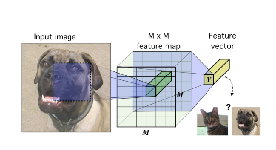
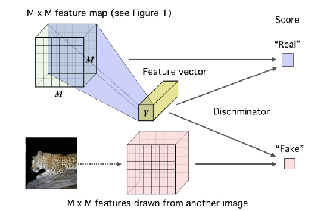
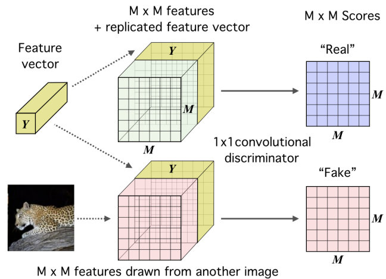
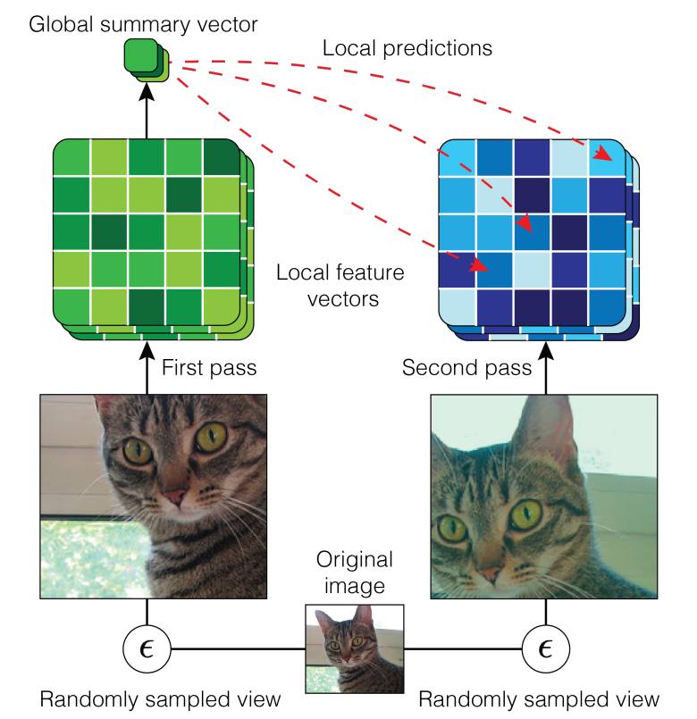
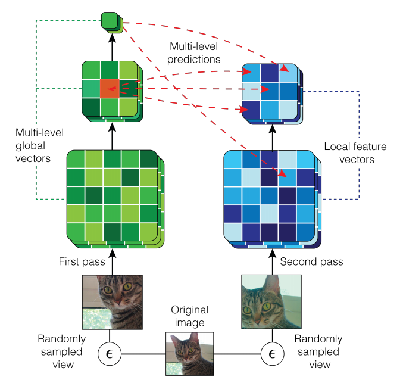
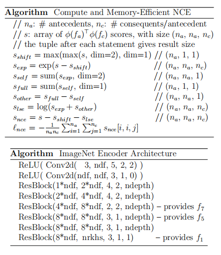

# 9月11日论文笔记

# 基于自监督的小样本学习方法DIM(MINE)->AMDIM

## DIM引言

DIM该方法与传统自监督学习构造的旋转、复原等伪任务不同，其直接基于互信息进行学习。此方法在几个分类任务上的表现皆优于许多流行的无监督学习方法，并可与有监督学习的效果相比拟。

DIM 依据以下标准训练编码器:

- (１)互信息最大化，即找到模型参数，使得原信息与表征信息的互信息最大化;。
- (２)统计约束，即使得编码器的输出满足某些约束。

例如将表征向量约束接近于一个已知先验分布无监督学习一个重要的问题就是学习有用的 ”表征“，本文的目的就是训练一个 “表征学习” 函数。通过最大化编码器输入和输出之间的互信息(MI)来学习对下游任务有用的 “表征”，而互信息可以通过 MINE 的方法进行估算。

文中提出，输入全区域和编码器输出最大化互信息更适合于重建性的任务，而在分类的下游任务上效果不太好。而输入的局部区域和编码器输出最大化互信息在下游任务（如图像分类）上的效果更好。因为这种方法类似于对抗自动编码器(AEE, adversarial autoencoders) 的，将MI最大化和先验匹配结合起来，根据期望的统计特性约束 “表征”，并且还与 infomax 的优化规则密切相关 ，因此作者称其为 Deep InfoMax(DIM).

## DIM介绍

在图像数据的上下文中的基本编码器模型。

传统的编码器经过卷积层后进入全连接层输出的“表征”直接用于下游任务，如分类。

具有全局深度的DIM模型。

DIM的思路是讲最后输出的“表征”与同一张图的特征图组合成样本对，与另外一张图的特征图组成负样本对，然后用GAN训练出一个判别器区分两组样本。

DIM 的优化方向主要是下面下面两点

- 1）最大化特征图与“表征”之间的互信息（根据需求分为global和local两种）。
- 2）在最终的“表征”中加入一个统计性的约束，使“表征”的分布尽量与先验分布相匹配。

### global infomax

互信息：X,Y若相互独立则P(X,Y)=P(X)P(Y)，互信息则为0，互信息定义：

$$
\mathcal{I}(\mathrm{X} ; \mathrm{Y})=\sum_{\mathrm{X}, \mathrm{Y}} \mathrm{P}(\mathrm{X}, \mathrm{Y}) \log \frac{\mathrm{P}(\mathrm{X} \mid \mathrm{Y})}{\mathrm{P}(\mathrm{X})}
$$

KL散度是衡量随机变量两个分布之间的差异，差异值越小说明分布越接近
$$
{\mathcal{D}_{\mathrm{KL}}(\mathrm{X} \| \mathrm{Y})=\mathbb{E}_{\mathrm{PXY}}\left[\log \frac{\mathrm{P}(\mathrm{X})}{\mathrm{P}(\mathrm{Y})}\right]}
$$
MI与KL散度的关系推导则为
$$
\begin{aligned}
\mathcal{I}(\mathrm{X} ; \mathrm{Y}) &=\sum_{\mathrm{X}, \mathrm{Y}} \mathrm{P}(\mathrm{X}, \mathrm{Y}) \log \frac{\mathrm{P}(\mathrm{X} \mid \mathrm{Y})}{\mathrm{P}(\mathrm{X})} \\
&=\iint \mathrm{P}(\mathrm{X}, \mathrm{Y}) \log \frac{\mathrm{P}(\mathrm{X} \mid \mathrm{Y})}{\mathrm{P}(\mathrm{X})} \\
&=\mathbb{E}_{\mathrm{PXY}}\left[\log \frac{\mathrm{P}(\mathrm{X} \mid \mathrm{Y})}{\mathrm{P}(\mathrm{X})}\right] \\
&=\mathbb{E}_{\mathrm{PXY}}\left[\log \frac{\mathrm{P}(\mathrm{X}, \mathrm{Y})}{\mathrm{P}(\mathrm{X}) \mathrm{P}(\mathrm{Y})}\right] \\
&=\mathcal{D}_{\mathrm{KL}}\left(\mathrm{P}{\mathrm{(XY)}} \| \mathrm{P}(\mathrm{X}) \mathrm{P}(\mathrm{Y})\right)
\end{aligned}
$$
Mutual Information Neural Estimation（MINE)方法，其基于KL散度的 Donsker-Varadhan representation 给出了互信息的下限，如下公式：
$$
\mathcal{I}(\mathrm{X} ; \mathrm{Y})=\mathcal{D}_{\mathrm{KL}}(\mathbb{J} \| \mathbb{M}) \geq =\mathbb{E}_{\mathbb{J}}\left[\mathrm{T}_{\omega}(\mathrm{x}, \mathrm{y})\right]-\log \mathbb{E}_{\mathbb{M}}\left[\mathrm{e}^{\mathrm{T}_{\omega}(\mathrm{x}, \mathrm{y})}\right]
$$
其中J是P(XY)，M是P(X)P(Y)

MINE公式推导：
$$
\begin{aligned}
\mathbb{E}_{\mathbb{P}}[\mathrm{T}] &-\log \left(\mathbb{E}_{\mathbb{Q}}[\mathrm{e}^{\mathrm{T}}]\right)=\sum_{\mathrm{i}} \mathrm{p}_{\mathrm{i}} \mathrm{t}_{\mathrm{i}}-\log \sum_{\mathrm{i}} \mathrm{q}_{\mathrm{i}} \mathrm{e}^{\mathrm{t}_{\mathrm{i}}} \\
& \rightarrow \frac{\partial\left[\sum_{\mathrm{i}} \mathrm{p}_{\mathrm{i}} \mathrm{t}_{\mathrm{i}}-\log \sum_{\mathrm{i}} \mathrm{q}_{\mathrm{i}} \mathrm{e}^{\mathrm{t}_{\mathrm{i}}}\right]}{\partial \mathrm{t}_{\mathrm{j}}}=0 \\
& \rightarrow \mathrm{p}_{\mathrm{j}}-\frac{\mathrm{q}_{\mathrm{j}} \mathrm{e}^{\mathrm{t}_{\mathrm{j}}}}{\sum_{\mathrm{i}} \mathrm{q}_{\mathrm{i}} \mathrm{e}^{\mathrm{t}_{\mathrm{i}}}}=0 \\
& \rightarrow \mathrm{p}_{\mathrm{j}} \sum_{\mathrm{i}} \mathrm{q}_{\mathrm{i}} \mathrm{e}^{\mathrm{t}_{\mathrm{i}}}=\mathrm{q}_{\mathrm{j}} \mathrm{e}^{\mathrm{t}_{\mathrm{j}}} \\
& \rightarrow \mathrm{t}_{\mathrm{j}}=\log \frac{\mathrm{p}_{\mathrm{j}}}{\mathrm{q}_{\mathrm{j}}}+\log \sum_{\mathrm{i}} \mathrm{q}_{\mathrm{i}} \mathrm{e}^{\mathrm{t}_{\mathrm{i}}}
\end{aligned}
$$

将后面一部分$\begin{aligned}
\log \sum_{\mathrm{i}} \mathrm{q}_{\mathrm{i}} \mathrm{e}^{\mathrm{t}_{\mathrm{i}}}
\end{aligned}$设为$\alpha$
$$
\begin{aligned}
\sum_{\mathrm{i}} \mathrm{p}_{\mathrm{i}} \mathrm{t}_{\mathrm{i}}-\log \sum_{\mathrm{i}} \mathrm{q}_{\mathrm{i}} \mathrm{e}^{\mathrm{t}_{\mathrm{i}}} &=\sum_{\mathrm{i}} \mathrm{p}_{\mathrm{i}} \mathrm{t}_{\mathrm{i}}-\log \sum_{\mathrm{i}} \mathrm{q}_{\mathrm{i}} \mathrm{e}^{\mathrm{t}_{\mathrm{i}}} \\
&=\sum_{\mathrm{i}} \mathrm{p}_{\mathrm{i}}\left(\log \frac{\mathrm{p}_{\mathrm{j}}}{\mathrm{q}_{\mathrm{j}}}+\alpha\right)-\log \sum_{\mathrm{i}} \mathrm{q}_{\mathrm{i}} \mathrm{e}^{\log \left(\frac{\mathrm{p}_{\mathrm{j}}}{\mathrm{q}_{\mathrm{j}}}+\alpha\right)} \\
&=\sum_{\mathrm{i}} \mathrm{p}_{\mathrm{i}}\left(\log \frac{\mathrm{p}_{\mathrm{j}}}{\mathrm{q}_{\mathrm{j}}}+\alpha\right)-\log \sum_{\mathrm{i}} \mathrm{e}^{\alpha} \mathrm{q}_{\mathrm{i}} \frac{\mathrm{p}_{\mathrm{j}}}{\mathrm{q}_{\mathrm{j}}} \\
&=\sum_{\mathrm{i}}\left(\mathrm{p}_{\mathrm{i}} \log \frac{\mathrm{p}_{\mathrm{j}}}{\mathrm{q}_{\mathrm{j}}}\right)+\alpha-\alpha \log \sum_{\mathrm{i}} \mathrm{q}_{\mathrm{i}} \frac{\mathrm{p}_{\mathrm{j}}}{\mathrm{q}_{\mathrm{j}}} \\
&=\sum_{\mathrm{i}}\left(\mathrm{p}_{\mathrm{i}} \log \frac{\mathrm{p}_{\mathrm{j}}}{\mathrm{q}_{\mathrm{j}}}\right)+\alpha-\alpha \cdot \log 1 \\
&=\sum_{\mathrm{i}} \mathrm{p}_{\mathrm{i}} \log \frac{\mathrm{p}_{\mathrm{j}}}{\mathrm{q}_{\mathrm{j}}} +\alpha\\
&=\mathrm{D}_{\mathrm{KL}}(\mathrm{p} \| \mathrm{q})+\alpha
\end{aligned}
$$

α大于0所以得到
$$
\mathcal{I}(\mathrm{X} ; \mathrm{Y})=\mathcal{D}_{\mathrm{KL}}(\mathbb{J} \| \mathbb{M}) \geq =\mathbb{E}_{\mathbb{J}}\left[\mathrm{T}_{\omega}(\mathrm{x}, \mathrm{y})\right]-\log \mathbb{E}_{\mathbb{M}}\left[\mathrm{e}^{\mathrm{T}_{\omega}(\mathrm{x}, \mathrm{y})}\right]
$$
最大化互信息则可以转变为最大化其下限，从而利用正样本和负样本可以写出损失函数并做分类
$$
\begin{aligned}
\operatorname{loss}_{\mathrm{G}} &=\max _{\omega, \psi} \hat{\mathcal{I}}_{\omega}^{(\mathrm{DV})}\left(\mathrm{f}_{\psi}(\mathrm{X}) ; \mathrm{E}_{\psi}(\mathrm{X})\right) \\
&=\max _{\omega, \psi} \mathbb{E}_{\mathrm{P}_{\mathrm{XY}}}\left[\mathrm{T}_{\omega}\left(\mathrm{f}_{\psi}(\mathrm{X}), \mathrm{E}_{\psi}(\mathrm{X})\right)\right]-\log \mathbb{E}_{\mathrm{PX}_{\mathrm{X}} \times \mathrm{P}_{\mathrm{X}}}\left[\mathrm{e}^{\mathrm{T}_{\omega}\left(\mathrm{f}_{\psi}(\mathrm{X}), \mathrm{E}_{\psi}(\mathrm{X})\right)}\right] \\
&=\min _{\omega, \psi}-\left(\mathbb{E}_{\mathrm{P}_{\mathrm{XY}}}\left[\mathrm{T}_{\omega}\left(\mathrm{f}_{\psi}(\mathrm{X}), \mathrm{E}_{\psi}(\mathrm{X})\right)\right]-\log \mathbb{E}_{\mathrm{PX}_{\mathrm{X}} \times \mathrm{P}_{\mathrm{X}}}\left[\mathrm{e}^{\mathrm{T}_{\omega}\left(\mathrm{f}_{\psi}(\mathrm{X}), \mathrm{E}_{\psi}(\mathrm{X})\right)}\right]\right)
\end{aligned}
$$
由于互信息也可以不通过KL散度来度量，所以可以换成其他的互信息方式，只要能将MI的边界最大化即可，作者尝试了

Jensen-Shannon MI estimator和 infoNCE两种方法
$$
\hat{\mathcal{I}}_{\omega, \psi}^{(\mathrm{JSD})}\left(\mathrm{X} ; \mathrm{E}_{\psi}(\mathrm{X})\right):=\mathbb{E}_{\mathbb{P}}\left[-\operatorname{sp}\left(-\mathrm{T}_{\psi, \omega}\left(\mathrm{x}, \mathrm{E}_{\psi}(\mathrm{x})\right)\right)\right]-\mathbb{E}_{\mathbb{P} \times \tilde{\mathbb{P}}}\left[\mathrm{sp}\left(\mathrm{T}_{\psi, \omega}\left(\mathrm{x}^{\prime}, \mathrm{E}_{\psi}(\mathrm{x})\right)\right)\right]
\\
, where  \ \operatorname{sp}(\mathrm{z})=\log \left(1+\mathrm{e}^{\mathrm{z}}\right) 
$$

$$
\hat{\mathcal{I}}_{\omega, \psi}^{(\mathrm{infoNCE})}\left(\mathrm{X} ; \mathrm{E}_{\psi}(\mathrm{X})\right):=\mathbb{E}_{\mathbb{P}}\left[\mathrm{T}_{\psi, \omega}\left(\mathrm{x}, \mathrm{E}_{\psi}(\mathrm{x})\right)-\mathbb{E}_{\tilde{\mathbb{P}}}\left[\log \sum_{\mathrm{x}^{\prime}} \mathrm{e}^{\mathrm{T}_{\psi, \omega}\left(\mathrm{x}^{\prime}, \mathrm{E}_{\psi}(\mathrm{x})\right)}\right]\right]
$$

### Local Infomax

对于一张图片来说，下游任务只是对图片进行分类，那么就没有必要对一些琐碎或者对分类任务无关紧要的像素。而如果我们的目标是最大化整张输入图片的 feature map 与 representation，那么编码器为了符合最后的全局最优情况，就有可能会选择到这些对下游任务并无实际作用的部分进行编码，这样得到的 representation 就肯定不会是针对下游任务最优的 representation。

而 Local Infoamx 的思想就是，我们并不将整张图片的 feature map 一次性输入损失函数来进行 MI 最大化，而是将其分为 M×M 块（M 不是指像素，而是指被分成了 M^2^ 个块），一次输入一个块和同一个 representation，最终目标是使这$m^2$个块和整张图片的 representation 的平均 MI 达到最大。这样就可以使给每个块之间共享的一些信息进行编码。

文中用实验证明了，根据下游任务的不同，Local Infomax在图像分类等一些下游任务中确实具有更好的效果，因此Local Infomax的损失函数为

$$
\begin{aligned}
\operatorname{loss}_{\mathrm{L}} &=\max _{\omega, \psi} \frac{1}{\mathrm{M}^{2}} \sum_{\mathrm{i}=1}^{\mathrm{M}^{2}} \hat{\mathcal{I}}_{\omega, \psi}\left(\mathrm{f}_{\psi}^{(\mathrm{i})}(\mathrm{X}) ; \mathrm{E}_{\psi}(\mathrm{X})\right) \\
&=\min _{\omega, \psi} \frac{1}{\mathrm{M}^{2}}-\sum_{\mathrm{i}=1}^{\mathrm{M}^{2}} \hat{\mathcal{I}}_{\omega, \psi}\left(\mathrm{f}_{\psi}^{(\mathrm{i})}(\mathrm{X}) ; \mathrm{E}_{\psi}(\mathrm{X})\right)
\end{aligned}
$$

### 匹配到先验分布的表示

若学习到的隐变量服从标准正态分布的先验分布，这有利于使得编码空间更加规整，甚至有利于解耦特征，便于后续学习。因此，在 DIM 中，我们同样希望加上这个约束，作者利用对抗自编码器（AAE）的思路引入对抗来加入这个约束，即训练一个新的鉴别器，而将编码器当做生成器。鉴别器的目标是区分"表征"分布的真伪（即是否符合先验分布），而编码器则是尽量欺骗判别器，输出更符合先验分布的"表征"。

判别器损失函数如下：
$$
(\hat{\omega}, \hat{\psi})_{P}=\underset{\psi}{\arg \min \arg \max } \widehat{\mathcal{D}}_{\phi}\left(\mathbb{V} \| \mathbb{U}_{\psi, \mathbb{P}}\right)=\mathbb{E}_{\mathbb{V}}\left[\log D_{\phi}(y)\right]+\mathbb{E}_{\mathbb{P}}\left[\log \left(1-D_{\phi}\left(E_{\psi}(x)\right)\right)\right]
$$
整合所有损失函数：
$$
\underset{\omega_1, \omega_2, \psi}{\arg \max }\left(\alpha \widehat{\mathcal{I}}_{\omega_1, \psi}\left(X ; E_\psi(X)\right)+\frac{\beta}{M^2} \sum_{i=1}^{M^2} \widehat{\mathcal{I}}_{\omega_2, \psi}\left(X^{(i)} ; E_\psi(X)\right)\right)+\underset{\psi}{\arg \min } \underset{\phi}{\arg \max } \gamma \widehat{\mathcal{D}}_\phi\left(\mathbb{V} \| \mathbb{U}_{\psi, \mathbb{P}}\right)
$$
之所以加上α 、 β 、 γ 三个参数，是因为有时候我们只想使用 global InfoMax (如重建类下游任务)，就可以将 β 设置为0；而有时候只想使用 Iocal InfoMax (如分类任务)，就可以将 α 设置为0；但这两种情况下，最佳的γ 是不同的，所以也需要 γ来进行调节.

## AMDIM 介绍

这篇文章是同一个团队对DIM的扩展研究，主要是在DIM的基础上引入了多视图，最大化一个共享上下文中不同视图之间的互信息，将迫使特征捕获更高级的共享上下文因素信息。在图片上我们可以通过对图片重复的应用数据增强来产生不同的视图（如旋转，裁剪等），对不同视图进行互信息计算可以使网络学到更广泛的共享上下文信息（提高对一个图片的泛化能力）

AMDIM在LOCAL DIM的基础上进行扩展，主要进行一下几点扩展：

- 首先，AMDIM最大限度地提高从每个图像的独立增广副本中提取的特征之间的互信息，而不是如DIM从每个图像的单个原始数据中提取的特征之间的互信息。(数据增强)

- 其次，AMDIM同时最大化多个特征尺度之间的互信息，而不是最大化单一的全局尺度和局部尺度之间的互信息。（多尺度金字塔）

- 第三AMDIM使用了相较于DIM更强大的编码器体系结构。（resnet）

- 提出了一种基于混合的repersentation

## AMDIM Method

Local DIM：最大化互信息$f_1(x)$和中间层的特征图$f_7(x)_{ij}:\forall i,j$之间的互信息，这里 f 表示的下标表示维度，如 $f_1$表示最终输出的是一维向量，而$f_7$表示输出的是$7\times7$的特征图。而下标 i , j 则表示在 local feature map 中某一图像块的索引位置。而两者的互信息实际上衡量的就是：在已知$f_1(x)$的情况对$ f_7(x)_{ij}$ij的预测，比未知 $f_1 ( x )$​ 时对其的预测要好多少。

在 AMDIM 中，作者根据逻辑上的作用来重新命名 global feature 和 local feature （在 DIM 中，是根据他们所处 encoder 中的位置）：

- 将对数据进行编码的特征，称为 antecedent features(global features)

- 将要预测的特征，称为 consequent features(local features)

### 噪声对比估计

目前局部DIM利用基于噪声对比估计(NCE)的互信息，在各种任务上效果最好，因此，我们可以通过最小化以下损失来最大化互信息的 NCE 下限：
$$
\underset{\left(f_1(x), f_7(x)_{i j}\right)}{\mathbb{E}}\left[\mathbb{E}_{N_7}\left[\mathcal{L}_{\Phi}\left(f_1(x), f_7(x)_{i j}, N_7\right)\right]\right]
$$
正样本对$\left(f_1(x), f_7(x)_{i j}\right)$通过联合分布$p\left(f_1(x), f_7(x)_{i j}\right)$表示，负样本$N_7$对由干扰项独立分布$p\left(f_7(x)_{i j}\right)$表示，$\Phi\left(f_1, f_7\right)$表示样本对是正样本对的可能性，$\Phi\left(f_1, f_7\right)$将特征对映射到标量上，其中标量越大则$(f_1, f_7）$是正样本对的可能性越大，反之则为负样本对的可能性越大。则设计如下损失函数
$$
\mathcal{L}_{\Phi}\left(f_1, f_7, N_7\right)=-\log \frac{\exp \left(\Phi\left(f_1, f_7\right)\right)}{\sum_{\tilde{f}_7 \in N_7 \cup\left\{f_7\right\}} \exp \left(\Phi\left(f_1, \tilde{f}_7\right)\right)}
$$

### 有效的NCE计算

当我们对许多正样本对使用很大的负样本集合$N_7$,例如$N_7$>10000，则可以通过简单的点成运算来计算$Phi\$从而有效的计算等式14中的下限
$$
\Phi\left(\mathrm{f}_1(\mathrm{x}), \mathrm{f}_7(\mathrm{x})_{\mathrm{ij}}\right) \triangleq \phi_1\left(\mathrm{f}_1(\mathrm{x})\right)^{\top} \phi_7\left(\mathrm{f}_7(\mathrm{x})_{\mathrm{ij}}\right)
$$
给定一个足够高维的向量空间，原则上我们应该能够通过线性计算来近似任何（合理的）函数类，在高维空间中的线性评价的能力可以通过考虑Reproducing Kernel Hilbert Spaces（RKHS）来理解。但是这种方法的缺点是模型在高维空间中具有不稳定性，我们使用一些技巧来减轻NCE成本中偶尔的不稳定性。

- 第一个技巧是添加一个加权正则化术语，以惩罚匹配分数的平方：$\lambda\left(\phi_1\left(f_1(x)\right)^{\top} \phi_7\left(f_7(x)_{i j}\right)\right)^2$所有实验中$\lambda=4 \mathrm{e}^{-2}$
- 第二个技巧是在计算正则化项后和在计算Eqn中的对数-softmax之前，对分数应用软裁剪非线性。定义了一个裁剪范围（-c,c）也就是在softmax之前套上了一层非线性函数tanh：$s^{\prime}=c \tanh \left(\frac{s}{c}\right)$，

### 数据增强

我们的模型通过最大化来自每个输入的增强视图的特征之间的互信息来扩展局部DIM，用 $\mathrm{A}(\mathrm{x})$表示对初始图像 x xx 进行随机数据增强后的分布，因此构建增强后的联合分布$\mathrm{p}_{\mathrm{A}}\left(\mathrm{f}_1\left(\mathrm{x}^1\right), \mathrm{f}_7\left(\mathrm{x}^2\right)_{\mathrm{ij}}\right)$

- 从原始图像中采样一个输入$x \sim \mathcal{D}$

- 随机进行两种数据增强，从数据增强后的分布分别进行取样$\mathrm{x}^1 \sim \mathrm{A}(\mathrm{x})$ 和 $\mathrm{x}^2 \sim \mathrm{A}(\mathrm{x})$

- 取样空间索引 $\mathrm{i} \sim \mathrm{u}(\mathrm{i})$ 和 $\mathrm{j} \sim \mathrm{u}(\mathrm{j})$

- 计算特征 $\mathrm{f}_1\left(\mathrm{x}^1\right)$ 和 $\mathrm{f}_7\left(\mathrm{x}^2\right)_{\mathrm{ij}}$

文章中采用的数据增强方法有：随机剪裁、颜色空间的随机抖动、随机转换为灰度，并且在计算 $\mathrm{x}^1$ 和 $\mathrm{x}^2$ 之前进行随机水平翻转。

### 多尺度信息

对同一张图片做了图像增强后 分别进入编码器，在不同尺度上做互信息，考虑最大化 任意两个层的输出的 feature map 中，任意两个位置的图像块块之间的互信息

因此我们可以构造出任意尺度之间的联合分布

如$\mathrm{p}_{\mathrm{A}}\left(\mathrm{f}_{5}\left(\mathrm{x}^{1}\right)_{\mathrm{ij}}, \mathrm{f}_{7}\left(\mathrm{x}^{2}\right)_{\mathrm{kl}}\right) 、 \mathrm{p}_{\mathrm{A}}\left(\mathrm{f}_{5}\left(\mathrm{x}^{1}\right)_{\mathrm{ij}}, \mathrm{f}_{5}\left(\mathrm{x}^{2}\right)_{\mathrm{kl}}\right), \mathrm{p}_{\mathrm{A}}\left(\mathrm{f}_{1}\left(\mathrm{x}^{1}\right)_{\mathrm{ij}}, \mathrm{f}_{5}\left(\mathrm{x}^{2}\right)_{\mathrm{kl}}\right)$等

则可以写出新的损失函数
$$
\underset{\left(\mathrm{f}_{\mathrm{n}}\left(\mathrm{x}^{1}\right)_{\mathrm{ij}}, \mathrm{f}_{\mathrm{m}}\left(\mathrm{x}^{2}\right)_{\mathrm{kl}}\right)}{\mathbb{E}}\left[\underset{\mathrm{N} \mathrm{m}}{\mathbb{E}}\left[\mathcal{L}_{\Phi}\left(\mathrm{f}_{\mathrm{n}}\left(\mathrm{x}^{1}\right)_{\mathrm{ij}}, \mathrm{f}_{\mathrm{m}}\left(\mathrm{x}^{2}\right)_{\mathrm{kl}}, \mathrm{N}_{\mathrm{m}}\right)\right]\right]
$$

### Encoder

基于标准ResNet的编码器并进行了更改，使其适用于DIM

再DIM中遇到的问题：

- 当正样本对中特征的接受域重叠过多时，任务变得太容易，模型表现更差。

- 另一个问题是通过避免填充来保持特征分布的平稳。

平均池化的尺度补偿不使用填充，而使用1×1的卷积控制感受野的生长。

### 混合特征表示方法

我们现在将我们的模型扩展到使用基于混合的特性。对于每个先验特征f1，我们计算一组混合特征$\left\{f_1^1, \ldots, f_1^k\right\}$k为混合分类个数，使用一个函数来计算这些特征$\left\{f_1^1, \ldots, f_1^k\right\}=m_k\left(f_1\right)$.我们使用一个具有单一ReLU隐藏层的全连接网络和f1和每个混合物特征fi1之间的残差连接来表示mk。当使用混合特征时，我们可以最大化地实现以下目标：
$$
\underset{f, q}{\operatorname{maximize}} \underset{\left(x^1, x^2\right)}{\mathbb{E}}\left[\frac{1}{n_c} \sum_{i=1}^{n_c} \sum_{j=1}^k\left(q\left(f_1^j\left(x^1\right) \mid f_7^i\left(x^2\right)\right) s_{n c e}\left(f_1^j\left(x^1\right), f_7^i\left(x^2\right)\right)+\alpha H(q)\right)\right]
$$
对于每个数据增强后的样本对 $\left(\mathrm{x}^1, \mathrm{x}^2\right)$ ，我们提取 $\mathrm{k}$ 个 mixture features $\left\{\mathrm{f}_1^1\left(\mathrm{x}^1\right), \ldots, \mathrm{f}_1^{\mathrm{k}}\left(\mathrm{x}^1\right)\right\}$ 和 $\mathrm{n}_{\mathrm{c}}$ 个 consequent features $\left\{\mathrm{f}_7^1\left(\mathrm{x}^2\right), \ldots, \mathrm{f}_7^{\mathrm{n}_{\mathrm{c}}}\left(\mathrm{x}^2\right)\right\}$ 。 $\mathrm{s}_{\mathrm{nce}}\left(\mathrm{f}_1^{\mathrm{j}}\left(\mathrm{x}^1\right), \mathrm{f}_7^{\mathrm{i}}\left(\mathrm{x}^2\right)\right)$ 表示 $\mathrm{f}_1^{\mathrm{j}}\left(\mathrm{x}^1\right)$ 和 $\mathrm{f}_7^{\mathrm{i}}\left(\mathrm{x}^2\right)$ 之间的 NCE score（3.3节中的计算方法)，这个分数给出了公式2 中互信息边界的 log-softmax 项，并且我们添加了一个熵最大化项 $\alpha H(q)$
实际上，给出通过 $\mathrm{k}$ 个 mixture features $\left\{\mathrm{f}_1^1, \ldots, \mathrm{f}_1^{\mathrm{k}}\right\}$ 分配给 consequent feature $\mathrm{f}_7^{\mathrm{i}}$ 的 $\mathrm{k}$ 个分数 $\left\{\mathrm{s}_{n c e}\left(\mathrm{f}_1^1, \mathrm{f}_7^{\mathrm{i}}\right), \ldots, \mathrm{s}_{n c e}\left(\mathrm{f}_1^{\mathrm{k}}, \mathrm{f}_7^{\mathrm{i}}\right)\right\}$ ，我们 可以计算 $\mathrm{q}$ 的最优分布如下:
$$
q\left(f_1^j \mid f_7^i\right)=\frac{\exp \left(\tau s_{n c e}\left(f_1^j, f_7^i\right)\right)}{\sum_{j^{\prime}} \exp \left(\tau s_{n c e}\left(f_1^{j^{\prime}}, f_7^i\right)\right)}
$$
其中， $\tau$ 是一个 temperature parameter，用来控制 $\mathrm{q}$ 的樀，等式19利用了强化学习的思想。给出分数 $\mathrm{s}_{\mathrm{n}} \mathrm{n}^{\mathrm{n}}\left(\mathrm{f}_1^{\mathrm{J}}, \mathrm{f}_7^{\mathrm{i}}\right)$ ，我们可以使用最大分 数的指标定义 $\mathrm{q}$ 。但是当 $\mathrm{q}$ 取决于随机分数时，这种选择在期望值上会过分乐观，因为它将偏向于由随机性推高的分数（来自对负样本 的取样）。我们不是取一个最大值，而是通过增加樀最大化项 $\alpha \mathrm{H}(\mathrm{x})$ 来鼓励 $\mathrm{q}$ 不那么贪婪。对于公式18中的任何 $\alpha$ 值，公式19中都存在 一个对应的 $\tau$ 值，因此使用公式19计算 q 可以提供选购对于公式18最佳的 q。在Soft Q Learning的背景下，这直接与最优玻尔兹曼型策略 的制定有关。实际上，我们将 $\tau$ 视为超参数。

