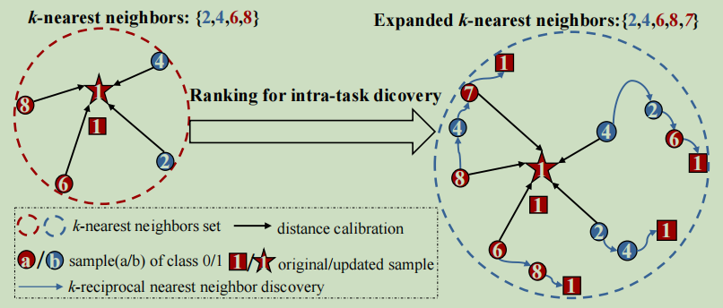
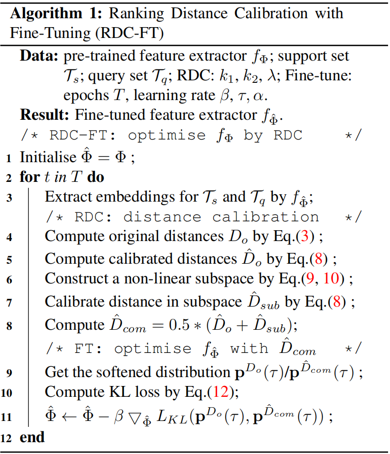
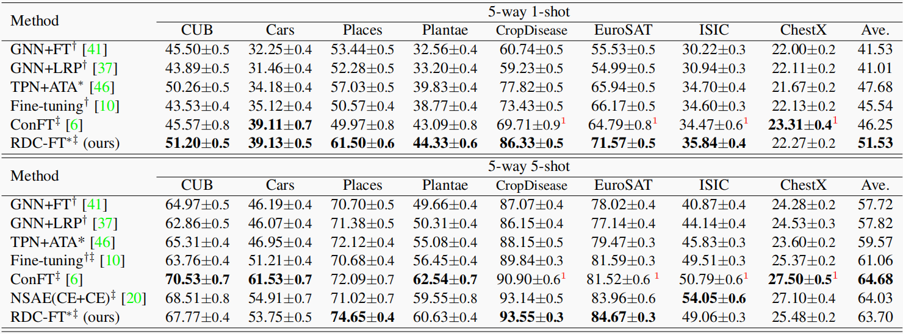

# Paper Reading

## 1.作者信息

- Pan Li，Shaogang Gong  腾讯优图

## 2.问题定义

**小样本学习的最新进展促进了对现实中更为常见的跨域小样本问题的研究。**

问题：在跨域小样本问题中，源数据集和目标数据集来自不同的域，且具有不相交的标签集合，因而它们可以共享知识极为有限。

因此，**本文侧重于在目标域中挖掘更多潜在信息，而非在源数据集上精心设计训练策略。**给定一个利用交叉熵损失在源数据集上预训练的特征提取器，本文着重从图像检索的角度去研究一个简单的基于距离的分类器。具体来讲，本文通过挖掘 k相互近邻的重排序过程来校准目标小样本任务的距离矩阵。

此外，通常预训练得到的特征表示是偏向于源数据集的，因此我们构建一个非线性子空间以最小化其中与任务无关的特征，并通过双曲正切变换保留更多可转移的判别信息。这种任务自适应的非线性子空间和预训练的特征空间，都可以通过重排序过程进行距离校准并得到一个鲁棒的互补校准距离。

为了进一步将距离校准信息传递到特征表示上，本文使用 Kullback-Leibler 散度来逐步引导特征空间的原始距离分布向校准后距离的分布对齐。

## 3.相关工作

贡献：

- 为了将源域表示空间中的偏置距离矩阵转换为 CD-FSL 中的目标域，我们通过发现任务中的k相互近邻重新排序，重新计算 Jaccard 距离校准。我们称之为排名距离校准。

- 我们提出了一个非线性子空间来覆盖预训练的源域表示空间。 这旨在对 CD-FSL 中的任何固有非线性变换进行建模，并用于促进源域和目标域之间的距离校准过程。 通过明确地建模这种非线性，我们为 CD-FSL 制定了一个更稳健、更通用的排名距离校准 (RDC) 模型。
- 我们进一步将RDC作为模型优化过程的约束条件。这是通过微调RDC（RDC-FT）实现的，迭代地将原始源域距离分布映射到校准的目标域距离分布，以获得更稳定和改进的CD-FSL。

**Few-shot learning**

一般FSL的方法可以大致分为两类：

- 基于优化的方法，它学习可通用的模型初始化，然后将模型应用于具有有限标记数据的新任务

- 度量学习、元学习一个有区别的嵌入空间，其中新任务中的样本可以通过一个常见的或学习的距离度量来很好地分类。

**Cross-domain few-shot learning**

- 跨域的小样本学习在单域训练模型泛化到其他域，

- 通过显式或隐式数据增强从源域学习一个可通用的模型。这些方法提高了模型的泛化能力，但由于它们忽略了目标域的自适应过程，因此很容易导致模糊的优化结果。

- 通过使用一种融合策略进行特征提取，然后学习一种掩码来选择于目标域相关的特征。

- 通过利用额外的未标记数据、标记数据或基础数据来实现目标域上的自适应。在实践中，增加的数据可以帮助在目标域上建模自适应，但这些信息并不容易获得。

**Ranking in image retrieval**

图像检索（IR）是一项经典的计算机视觉任务，其目的是搜索未标记的图库数据，以找到那些与探针图像最相似的图像。在IR中，其中一个排名方法是通过距离度量来计算一个排名列表。此外，还提出了不同的重新排序思想作为一种后处理机制来改进初始排序结果。例如，一个模型使用k相互近邻的概念来探索更多的困难正样本。然后利用扩大的k-最近邻重新计算一个Jaccard距离作为一个辅助距离矩阵。这一想法被其他人进一步采用为IR 。

**作者的工作**

在这项工作中，我们探索了在小样本学习中重新排序的概念。虽然与[48]的工作有关，但我们的方法有所不同。[48]的思想是通过在预先训练的空间中的图视图来提高子图的相似性。相比之下，我们的想法是在预先训练过的空间和任务自适应的子空间中校准相似性距离。为了优化特征表示，我们使用这个校准的距离来指导跨领域知识与KL勒散度损失的转移。[48]的模型在重新排序时并不学习跨领域的知识。它使用MLP在具有交叉熵损失的单个域内进行元学习。

## 4.动机和思路

### 

动机：之前的工作表明，在图库数据中发现k相互近邻可以有利于图像检索的重新排序结果。作者使用k相互近邻发现过程来校准FSL任务中的成对距离。图1给出了一个说明：k相互近邻 发现过程为一个给定的查询样本找到了更多的困难阳性样本。然后使用这些困难阳样本通过k相互近邻编码更新每个成对距离，并通过查询扩展进一步估计更好的距离。FSL任务中的这些成对距离被校准并用一个新的距离矩阵表示。作者首先计算欧式距离举矩阵，然后计算k近邻，通过k相互近邻算法重新排序，发现更多的正样本，

## 5.算法流程

### 1）前期工作

**k-reciprocal discovery and encoding**（k相互近邻）

这个算法的思路就是：如果两张图片A，B相似，那么B应该会在A的前K个近邻里面，反过来，A也会在B的前K个近邻里面。但如果两张图C，D不相似，即使C在D的前K个近邻里面，D也不会在C的前K个近邻里面。

**Jaccard distance** 
$$
d_J\left(i, g_q\right)=1-\frac{\sum_{j=1}^n \min \left(\mathcal{V}_{i, g_j}, \mathcal{V}_{g_q, g_j}\right)}{\sum_{j=1}^n \max \left(\mathcal{V}_{i, g_j}, \mathcal{V}_{g_q, g_j}\right)}
$$
**Distance calibration**

Jaccard距离利用上下文信息来计算k-倒数邻居中的上下文中的相对距离。原始距离是在预先训练好的欧几里得空间中的一个绝对距离。因此，结合DJ和Do，通过加权策略使邻居之间的距离更具区分性：
$$
\hat{D}_o=\lambda D_o+(1-\lambda) D_J
$$

### 2）**RDC in Task-adaptive Non-linear Subspace**

我们特别定制了一个鉴别子空间来帮助校准CD-FSL任务中的排名。子空间建立在主成分分析（PCA）的基础上，从原始空间中提取关键特征。
$$
X_{s u b}=X P, \quad \text { where } \mathcal{P} \in \Re^{m \times p}, X_{s u b} \in \Re^{n \times p}
$$

**双曲切线变换**

通常，PCA方法可以直接用于原始的嵌入空间。然而，由于原始表示X的偏置和较差的嵌入是分散的；因此降维容易导致信息丢失问题。为了解决这个问题，我们考虑将原始表示转换为一个紧凑且有代表性的非线性空间。利用核的思想，利用双曲切函数构造一个任务自适应非线性子空间。
$$
\mathcal{K}=\tanh \left(X^T X\right), \mathcal{K} \in \Re^{m \times m}
$$
然后利用奇异值分解（SVD）计算K的特征值U，并选择最与p相关的特征值$U_p$，构造变换矩阵$P = U_p$。

**互补的距离校准**

我们的距离校准过程是空间不可知的，可以应用于原始的线性空间和非线性的子空间(双曲线)。原空间具有更高的维数，由完整的信息组成，但也受到有噪声的任务无关特征的干扰，而非线性子空间减少了一些与任务无关的信号，但丢失了一些信息。我们的RDC方法共同利用两个空间中校准的距离来捕获一个鲁棒和互补的距离矩阵$\hat{D}_{c o m}=0.5\left(\hat{D}_o+\hat{D}_{s u b}\right)$。算法流程如下4-8行。

### 3）RDC微调

由于$D_{com}$提供了一个更鲁棒和可鉴别的距离矩阵，我们将这种类型的校准知识用于优化特征提取器。为了实现这一点，我们通过迭代地将原始距离分布映射到校准的距离分布来微调特征提取器，形成了一种RDC方法。如上算法

**将k相互近邻加入注意力**
$$
\mathcal{M}_i^{g_q}= \begin{cases}1+\alpha & \text { if } g_q \in \hat{\mathcal{R}}_i(k) \\ 1 & \text { otherwise }\end{cases}
$$
其中，α是一个注意力标量。在微调过程中，使用M将距离矩阵$D_o$和$D_{com}$分别重新加权为$M·D_o$和$M·D_{com}$。

**损失函数**

为了实现距离分布对齐，采用均方误差（MSE）损失和柯氏（KL）散度损失。MSE损失倾向于直接向目标距离学习，而KL散度损失侧重于匹配[的分布。作者选择KL损失
$$
\mathcal{L}_{K L}\left(\mathbf{p}^{D_o}(\tau), \mathbf{p}^{\hat{D}_{c o m}}(\tau)\right)=\tau^2 \sum_j \mathbf{p}_j^{\hat{D}_{c o m}}(\tau) \log \frac{\mathbf{p}_j^{\hat{D}_{c o m}}(\tau)}{\mathbf{p}_j^{D_o}(\tau)}
$$

** **

## 6.实验结果

## 7.源代码分析

- 如果作者提供了源代码, 我们需要对源代码进行阅读和分析, 应该回答如下问题:
  - 预期是否可以复现出作者的实验结果? 代码是否完整?
  - 对于某些特殊模块是怎么实现的? 可以示例核心代码.
  - 是否有一些实验细节文章中没有提及, 但是在代码中有体现的?

## 8.参考文献

 [48]Shell Xu Hu Othman Sbai Mathieu Aubry Xi Shen, Yang Xiao. Re-ranking for image retrieval and transductive few-shot classification. NeurIPS, 2021. 3